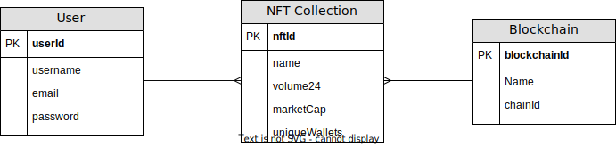

# CRYPTOCURRENCY TRACKER

#### A platform following the top cryptocurrency market where the user can keep track of their favorite cryptocurrencies as well as add/edit their positions in those assets

#### Deployment Link: [Crypto-Tracker](https://git.heroku.com/bn-crypto-tracker.git)
---
## User Stories
- As a user, I want to see the most popular cryptocurrencies to keep up with the trends
- As a user, I want to keep track of my favorite cryptocurrencies to keep track of them
- As a user, I want to have a place to add my positions to see the progress of my portfolio 
---
## Technologies Used
#### Front-End: HTML, CSS, JavaScript
#### Back-End: SQL, Node, Express
#### API: CoinAPI
---
## Installation Instructions
- Fork and clone repository
- Run `npm i`
- Run `createdb crypto_tracker`
- Run `sequelize db:migrate` to create tables
- Go to [CoinAPI](https://www.coinapi.io/) to get a free API key
- Create a `.env` file and copy the keys to the file
- Your `.env` file should look like below: </br>
```
COINAPI_KEY=YOUR-API-KEY-HERE
SECRET=ANY-WORD-OR-PHRASE-HERE
```
___
## ERDS

---
### RESTful Routing Chart
|VERB|URL PATTERN|ACTION|DESCRIPTION|
|----|-----------|------|-----------|
|GET|/crypto|Index(Read)|List of all cryptocurrencies|
|GET|/crypto/:id|Show(Read)|List details of a specific cryptocurrency|
|POST|/crypto/:id|Add(Update)|Add cryptocurrency to Favorites|
|GET|/user/new|New(Read)|Shows form to create a new account|
|POST|/user/new|Create(Create)|Creates a new account|
|GET|/user/login|Login(Read)|Shows form to login|
|POST|/user/login|Authorization(Create)|Create authorization to login to account|
|GET|/user/favorites|Favorites(Read)|List of favorited cryptocurrencies|
|DELETE|/user/favorites|Remove(Delete)|Remove NFT collection from Favorites|
|GET|/user/portfolio|Show(Read)|Show user's cryptocurrency positions|
|POST|/user/portfolio|Create(Create)|Create a cryptocurrency position|
|PUT|/user/portfolio/edit|Update(Update)|Update cryptocurrency position|
|DELETE|/user/portfolio/edit|Delete(Delete)|Delete cryptocurrency position|
|GET|/user/logout|Logout(Read)|Logout of account|
---
## Wireframes

---
## MVP Goals
- Successful connection to CoinAPI and importing data
- Page with list of cryptocurrencies
- Pages for each specific cryptocurrency with additional details
- Add to Favorites button to add to the user’s Favorites page
- New Account/Login Page with option to logout once logged in
- Able to add, edit and delete positions to their portfolio
---
## Stretch Goals
- Add Reddit/Twitter API and show most recent relevant posts/tweets in cryptocurrency pages
- Add a Search Bar and Sorting to the lists
- Add a closing position option in portfolio and keeping track of history
